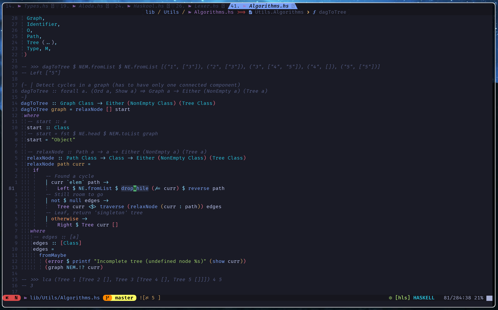

<div align="center">
    <p>
        <a href="https://github.com/neovim/neovim">
            
        </a>
        <a href="https://github.com/reo101/reovim/pulse">
            
        </a>
        <a href="https://github.com/reo101/reovim/blob/main/LICENSE">
            
        </a>
    </p>
    <p>
        <a href="https://fennel-lang.org/">
            
        </a>
        <a href="https://www.lua.org/">
            
        </a>
    </p>
</div>

```
     ___           ___           ___                                    ___
    /  /\         /  /\         /  /\          ___        ___          /__/\
   /  /::\       /  /:/_       /  /::\        /__/\      /  /\        |  |::\
  /  /:/\:\     /  /:/ /\     /  /:/\:\       \  \:\    /  /:/        |  |:|:\
 /  /:/~/:/    /  /:/ /:/_   /  /:/  \:\       \  \:\  /__/::\      __|__|:|\:\
/__/:/ /:/___ /__/:/ /:/ /\ /__/:/ \__\:\  ___  \__\:\ \__\/\:\__  /__/::::| \:\
\  \:\/:::::/ \  \:\/:/ /:/ \  \:\ /  /:/ /__/\ |  |:|    \  \:\/\ \  \:\~~\__\/
 \  \::/~~~~   \  \::/ /:/   \  \:\  /:/  \  \:\|  |:|     \__\::/  \  \:\
  \  \:\        \  \:\/:/     \  \:\/:/    \  \:\__|:|     /__/:/    \  \:\
   \  \:\        \  \::/       \  \::/      \__\::::/      \__\/      \  \:\
    \__\/         \__\/         \__\/           ~~~~                   \__\/
```

---

# Showcase



# Dependencies

- `git`
- A `C/C++` compiler for the treesitter parsers (`gcc/g++`, `clang/clang++`, `zig`)
- (Optional) `cargo` for `parinfer-rust`
- (Optional) `fzf` and `rg` for `Telescope`
- (Optional) any of the required Language Servers for the languages mentioned [here](./fnl/rv-config/lsp/init.fnl)

# Installation

- Firstly get a `nvim` binary:

  - [Installing NeoVim](https://github.com/neovim/neovim/wiki/Installing-Neovim) (Official Wiki)

```bash
git clone https://www.github.com/reo101/reovim "~/.config/reovim"
NVIM_APPNAME=reovim nvim
```

- Run `nvim`. On the first run, it will bootstrap the `tangerine` Fennel Loader, the `lazy.nvim` package manager and then the rest of the packages.

> NOTE: (hopefully) soon with Nix

# Directory overview

- [`init.lua`](./init.lua) - Entry point for Neovim
- [`lua/`](./lua/) - Lua config files
    - [`bootstrap-tangerine.lua`](./lua/bootstrap-tangerine.lua) - `tangerine` bootstrapper
    - `rv-*package*/init.lua` - Package configurations (in `lua`)
- [`fnl/`](./fnl/) - Fennel config files
    - [`initialize.fnl`](./fnl/initialize.fnl) - Entry point for Fennel config
    - [`init-macros.fnl`](./fnl/init-macros.fnl) - Fennel macros used throughout the Fennel config
    - [`packages.fnl`](./fnl/packages.fnl) - Packages' definition location
    - `rv-*package*/init.fnl` - Package configurations (in `fennel`)
    - [`autocommands.fnl`](./fnl/autocommands.fnl) - Autocommands
    - [`settings.fnl`](./fnl/settings.fnl) - `vim` settings
    - [`def-keymaps`](./fnl/def-keymaps.fnl) - `which-key`-esque utility function for easily defining keymaps using nested tables
    - [`fp`](./fnl/fp) - Functional programming utils (`List`, `Option`, `Result` and their `Functor` and `Monad` instances)
- [`luasnippets/`](./luasnippets/) - LuaSnip snippets
- [`queries/`](./after/queries/) - Custom Treesitter queries

---
