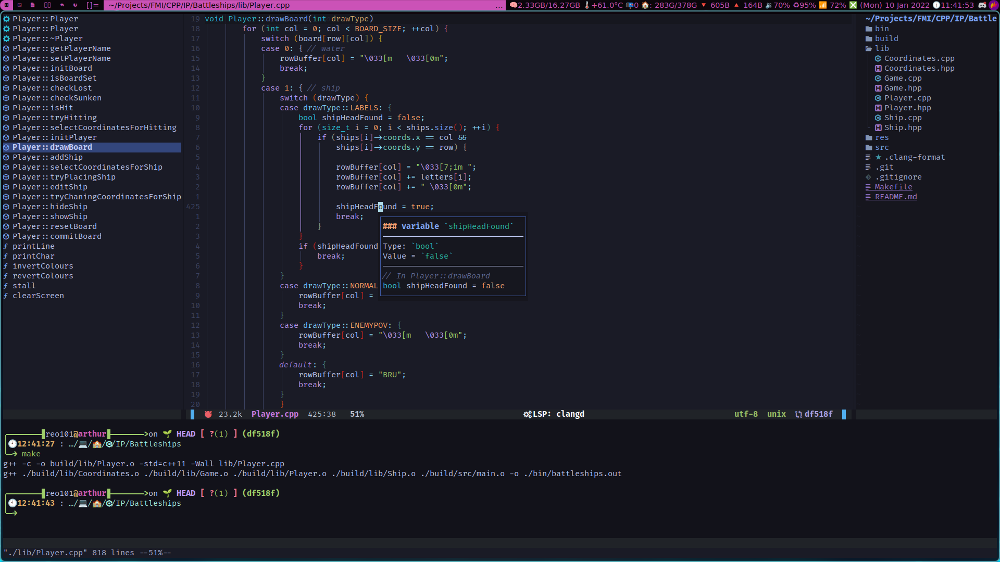
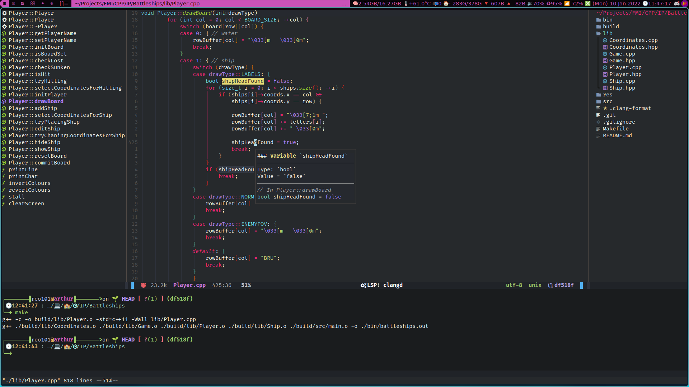
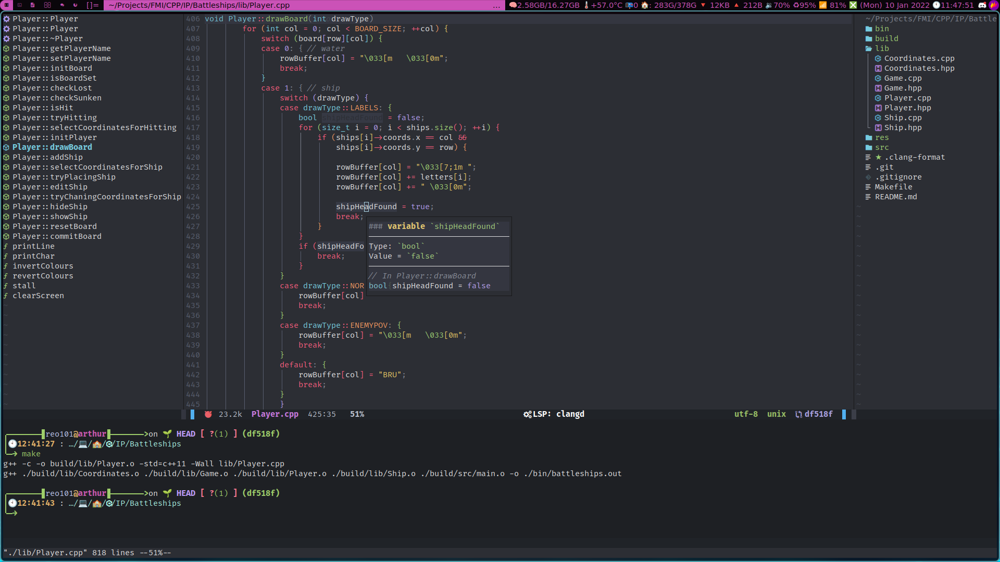
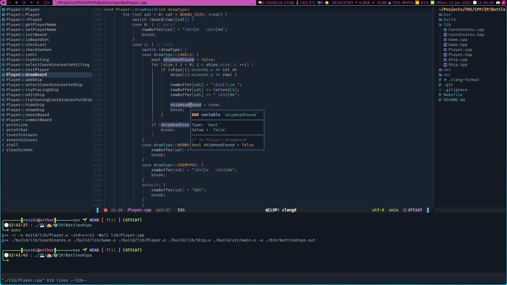
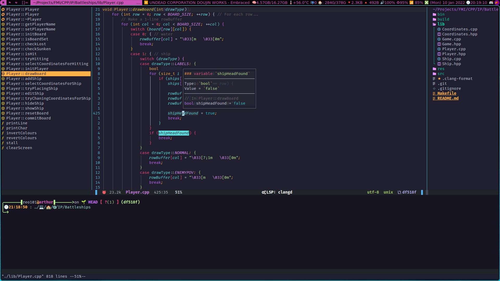

<div align="center"><p>
    <a href="https://github.com/neovim/neovim">
        
    </a>
    <a href="https://github.com/lunarvim/LunarVim/pulse">
        
    </a>
    <a href="https://github.com/lunarvim/LunarVim/blob/main/LICENSE">
        
    </a>
</p></div>

```
     ___           ___           ___                                    ___
    /  /\         /  /\         /  /\          ___        ___          /__/\
   /  /::\       /  /:/_       /  /::\        /__/\      /  /\        |  |::\
  /  /:/\:\     /  /:/ /\     /  /:/\:\       \  \:\    /  /:/        |  |:|:\
 /  /:/~/:/    /  /:/ /:/_   /  /:/  \:\       \  \:\  /__/::\      __|__|:|\:\
/__/:/ /:/___ /__/:/ /:/ /\ /__/:/ \__\:\  ___  \__\:\ \__\/\:\__  /__/::::| \:\
\  \:\/:::::/ \  \:\/:/ /:/ \  \:\ /  /:/ /__/\ |  |:|    \  \:\/\ \  \:\~~\__\/
 \  \::/~~~~   \  \::/ /:/   \  \:\  /:/  \  \:\|  |:|     \__\::/  \  \:\
  \  \:\        \  \:\/:/     \  \:\/:/    \  \:\__|:|     /__/:/    \  \:\
   \  \:\        \  \::/       \  \::/      \__\::::/      \__\/      \  \:\
    \__\/         \__\/         \__\/           ~~~~                   \__\/
```

---

# Showcase



# Installation

- Firstly install `neovim`:

  - [Installing NeoVim](https://github.com/neovim/neovim/wiki/Installing-Neovim) (Official Wiki)

- Back up any old configs
  - Assuming `$XDG_CONFIG_HOME` is `$HOME/.config` and `$XDG_DATA_HOME` is `$HOME/.local/share`

```bash
mv "${HOME}/.config/nvim" "${HOME}/.config/nvim_backup"
mv "${HOME}/.local/share/nvim" "${HOME}/.local/share/nvim_backup"
git clone https://www.github.com/reo101/reovim "${HOME}/.config/nvim"
```

- On the first run, neovim will bootstrap the `Packer` package manager

- Run `:PackerInstall` once to install all the packages

# Packages

- Packages are located at [`./lua/plugins/packages.lua`](./lua/plugins/packages.lua) with separate package-specific config in `./lua/rv-*package*/init.lua`

## Noteable packages:

### Themes:

- [monokai](https://www.github.com/tanvirtin/monokai.nvim)
  
- [sonokai](https://www.github.com/sainnhe/sonokai)
  
- [nightfox](https://www.github.com/EdenEast/nightfox.nvim)
  
- [tokyonight](https://www.github.com/folke/tokyonight.nvim)
  
- [nebulous](https://www.github.com/Yagua/nebulous.nvim)
  

### Telescope

- **[Telescope](https://www.github.com/nvim-telescope/telescope/nvim)**
- [Packer extension](https://www.github.com/nvim-telescope/telescope-packer.nvim)
- [FZF picker](https://www.github.com/nvim-telescope/telescope-fzf-native.nvim)
- [Github extension](https://www.github.com/nvim-telescope/telescope-github.nvim)
- [Media Files extension](https://www.github.com/nvim-telescope/telescope-media-files.nvim)
- [Symbols extension](https://www.github.com/nvim-telescope/telescope-symbols.nvim)
- [File Browser extension](https://www.github.com/nvim-telescope/telescope-file-browser.nvim)

### Neorg

- **[Neorg](https://www.github.com/vhyrro/neorg)**
- [Neorg Telescope extension](https://www.github.com/vhyrro/neorg-telescope)

### Markdown utils

- [Markdown Previewer](https://www.github.com/iamcco/markdown-preview.nvim)
- [Markdown link follower](https:://www.github.com/jghauser/follow-md-links.nvim)

### Which-key

- [Which-key](https://www.github.com/folke/which-key.nvim)

### Dashboard

- [Dashboard](https://www.github.com/glepnir/dashboard.nvim)

### Statusline

- [Lualine](https://www.github.com/hoob3rt/lualine.nvim)

### Tabline

- [BarBar](https://www.github.com/romgrk/barbar.nvim)

### Discord RPC

- [Presence](https://www.github.com/andweeb/presence.nvim)

### Notifications

- [Notify](https://www.github.com/rcarriga/nvim-notify)

### LSP

- **[LSP Config](https://www.github.com/neovim/nvim-lspconfig)**
- [Trouble](https://www.github.com/folke/trouble.nvim)
- [LSP Signature](https://www.github.com/ray-x/lsp_signature.nvim)
- [LSP Kind](https://www.github.com/onsails/lspkind-nvim)
- [Aerial](https://www.github.com/stevearc/aerial.nvim)
- [Dressing](https://www.github.com/stevearc/dressing.nvim)

#### Additional Language Server plugins

- [Null LS](https://www.github.com/jose-elias-alvarez/null-ls.nvim)
- [Rust Tools](https://www.github.com/simrat39/rust-tools.nvim)
  - [Crates](https://www.github.com/saecki/crates.nvim)
- [Metals](https://www.github.com/scalameta/nvim-metals)

### DAP

- **[DAP](https://www.github.com/mfussenegger/nvim-dap)**
- [DAP Virtual Text](https://www.github.com/theHamsta/nvim-dap-virtual-text)
- [DAP UI](https://www.github.com/rcarriga/nvim-dap-ui)

### Completion

- **[CMP](https://www.github.com/hrsh7th/nvim-cmp)**
- [CMP LSP](https://www.github.com/hrsh7th/cmp-nvim-lsp)
- [CMP LuaSnip](https://www.github.com/saadparwaiz1/cmp_luasnip)
- [CMP Buffer](https://www.github.com/hrsh7th/cmp-buffer)
- [CMP NVim Lua](https://www.github.com/hrsh7th/cmp-nvim-lua)
- [CMP Path](https://www.github.com/hrsh7th/cmp-path)
- [CMP Calc](https://www.github.com/hrsh7th/cmp-calc)
- [CMP Spell](https://www.github.com/f3fora/cmp-spell)
- [CMP Tmux](https://www.github.com/andersevenrud/compe-tmux)
- [CMP Cmdline](https://www.github.com/hrsh7th/cmp-cmdline)
- [Autopairs](https://www.github.com/windwp/nvim-autopairs)

#### Snippets

- **[LuaSnip](https://www.github.com/L3MON4D3/LuaSnip)**
- [Friendly Snippets](https://www.github.com/rafamadriz/friendly-snippets)

### Focus

- [Zen Mode]()
- [Twilight](https://www.github.com/folke/twilight.nvim)
- [Shade](https://www.github.com/sunjon/shade.nvim)

### Treesitter

- **[Treesitter](https://www.github.com/nvim-treesitter/nvim-treesitter)**
- [Treesitter Textobjects](https://www.github.com/nvim-treesitter/nvim-treesitter-textobjects)
- [Treesitter Playground](https://www.github.com/nvim-treesitter/playground)
- [Treesitter Rainbow](https://www.github.com/p00f/nvim-ts-rainbow)
- [Treesitter Context](https://www.github.com/romgrk/nvim-treesitter-context)
- [Treesitter Commentstring](https://www.github.com/JoosepAlviste/nvim-ts-context-commentstring)

### General Utility

- [Hop](https://www.github.com/phaazon/hop.nvim)
- [Hlslens](https://www.github.com/kevinhwang91/nvim-hlslens)
- [Surround](https://www.github.com/blackCauldron7/surround.nvim)
- [Tabout](https://www.github.com/abecodes/tabout.nvim)
- [Lastplace](https://www.github.com/ethanholz/nvim-lastplace)
- [Sort](https://www.github.com/sQVe/sort.nvim)
- [Navigator](https://www.github.com/numToStr/Navigator.nvim)
- [Dial](https://www.github.com/monaqa/dial.nvim)
- [EasyAlign](https://www.github.com/junegunn/vim-easy-align)
- [NumberToggle](https://www.github.com/jeffkreeftmeijer/vim-numbertoggle)
- [Mkdir](https://www.github.com/jghauser/mkdir.nvim)
- [BufDelete](https://www.github.com/famiu/bufdelete.nvim)
- [BufResize](https://www.github.com/kwkarlwang/bufresize.nvim)
- [Stabilize](https://www.github.com/luukvbaal/stabilize.nvim)
- [WinShift](https://www.github.com/sindrets/winshift.nvim)
- [QFList](https://www.github.com/kevinhwang91/nvim-bqf)
- [IndentLine](https://www.github.com/lukas-reineke/indent-blankline.nvim)

### Terminal Manager

- [ToggleTerm](https://www.github.com/akinsho/toggleterm.nvim)

### File Explorer

- [Tree](https://www.github.com/kyazdani42/nvim-tree.lua)

### Git

- **[NeoGit](https://www.github.com/TimUntersberger/neogit)**
- [DiffView](https://www.github.com/sindrets/diffview.nvim)
- [GitSigns](https://www.github.com/lewis6991/gitsigns.nvim)
- [GitWorktree](https://www.github.com/ThePrimeagen/git-worktree.nvim)
- [Octo](https://www.github.com/pwntester/octo.nvim)
- [GitLinker](https://www.github.com/ruifm/gitlinker.nvim)

### Commenting

- [Comment](https://www.github.com/numToStr/Comment.nvim)
- [TODO Comments](https://www.github.com/folke/todo-comments.nvim)

---


