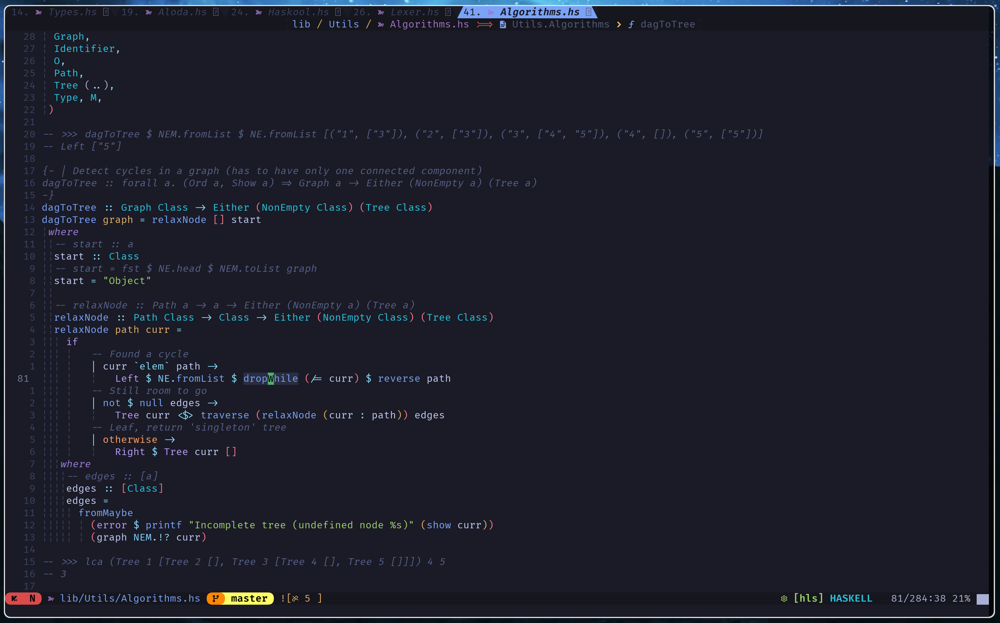

<div align="center">
    <p>
        <a href="https://github.com/neovim/neovim">
            
        </a>
        <a href="https://github.com/reo101/reovim/pulse">
            
        </a>
        <a href="https://github.com/reo101/reovim/blob/main/LICENSE">
            
        </a>
    </p>
    <p>
        <a href="https://fennel-lang.org/">
            
        </a>
        <a href="https://www.lua.org/">
            
        </a>
    </p>
</div>

```
     ___           ___           ___                                    ___
    /  /\         /  /\         /  /\          ___        ___          /__/\
   /  /::\       /  /:/_       /  /::\        /__/\      /  /\        |  |::\
  /  /:/\:\     /  /:/ /\     /  /:/\:\       \  \:\    /  /:/        |  |:|:\
 /  /:/~/:/    /  /:/ /:/_   /  /:/  \:\       \  \:\  /__/::\      __|__|:|\:\
/__/:/ /:/___ /__/:/ /:/ /\ /__/:/ \__\:\  ___  \__\:\ \__\/\:\__  /__/::::| \:\
\  \:\/:::::/ \  \:\/:/ /:/ \  \:\ /  /:/ /__/\ |  |:|    \  \:\/\ \  \:\~~\__\/
 \  \::/~~~~   \  \::/ /:/   \  \:\  /:/  \  \:\|  |:|     \__\::/  \  \:\
  \  \:\        \  \:\/:/     \  \:\/:/    \  \:\__|:|     /__/:/    \  \:\
   \  \:\        \  \::/       \  \::/      \__\::::/      \__\/      \  \:\
    \__\/         \__\/         \__\/           ~~~~                   \__\/
```

---

# Showcase



# Dependencies

- `git`
- A `C/C++` compiler for the treesitter parsers (`gcc/g++`, `clang/clang++`, `zig`)
- (Optional) `cargo` for `parinfer-rust`
- (Optional) `fzf` and `rg` for `Telescope`
- (Optional) any of the required Language Servers for the languages mentioned [here](./fnl/rv-config/lsp/init.fnl)

# Installation

- Get a recent `nvim` binary:
  - [Installing NeoVim](https://github.com/neovim/neovim/wiki/Installing-Neovim)

```bash
git clone https://www.github.com/reo101/reovim ~/.config/reovim
NVIM_APPNAME=reovim nvim
```

- First startup bootstraps `nfnl`, the custom Fennel loader, and the plugin set.
- To precompile everything manually, run `:NfnlCompileAll`.
- Nix users can build or run the wrapped package directly:

```bash
nix build .#reovim
nix run .#reovim
```

- Profile variants are exposed as passthroughs and top-level packages:

```bash
nix build .#reovim.full
nix build .#reovim.dev
nix build .#reovim.lite
nix build .#reovim.writing
```

# Directory overview

- [`init.lua`](./init.lua) - Entry point for Neovim
- [`.nfnl.fnl`](./.nfnl.fnl) - `nfnl` compile routing and output placement
- [`lua/`](./lua/) - Tracked bootstrap Lua plus Nix build outputs
    - [`bootstrap-nfnl.lua`](./lua/bootstrap-nfnl.lua) - compiled bootstrap copy of [`fnl/bootstrap-nfnl.fnl`](./fnl/bootstrap-nfnl.fnl)
    - [`fennel-loader.lua`](./lua/fennel-loader.lua) - compiled bootstrap copy of [`fnl/fennel-loader.fnl`](./fnl/fennel-loader.fnl)
- [`fnl/`](./fnl/) - Fennel config files
    - [`initialize.fnl`](./fnl/initialize.fnl) - main Fennel entrypoint after bootstrap
    - [`bootstrap-nfnl.fnl`](./fnl/bootstrap-nfnl.fnl) - startup/bootstrap logic
    - [`fennel-loader.fnl`](./fnl/fennel-loader.fnl) - custom Fennel and macro injection
    - [`packages.fnl`](./fnl/packages.fnl) - plugin loading through `lze` / `vim.pack`
    - [`packages/specs.fnl`](./fnl/packages/specs.fnl) - side-effect-free plugin spec discovery shared by runtime loading and lockfile sync
    - [`settings.fnl`](./fnl/settings.fnl) - global `vim.opt` and UI setup
    - [`autocommands.fnl`](./fnl/autocommands.fnl) - global autocommands and navigation helpers
    - [`def-keymaps.fnl`](./fnl/def-keymaps.fnl) - nested keymap DSL wrapper
    - [`rv-config/`](./fnl/rv-config/) - plugin and feature modules grouped by domain
    - [`macros/`](./fnl/macros/) - injected Fennel aliases and typed-fennel bootstrap
    - [`fp/`](./fnl/fp/) - local functional programming utilities and experiments
- [`after/`](./after/) - ftplugins, filetype detection, and treesitter query overrides
- [`luasnippets/`](./luasnippets/) - LuaSnip snippets
- [`nix/`](./nix/) - flake module, lockfile builders, treesitter grammar packaging, and helper derivations
- [`nvim-pack-lock.json`](./nvim-pack-lock.json) - pinned plugin and grammar lockfile used by Nix

---
